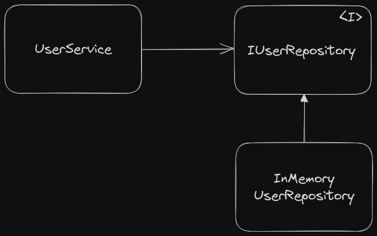

### リポジトリ

リポジトリはデータを永続化し、再構築するといった処理を抽象的に扱うためのオブジェクト。オブジェクトのインスタンスを保存するときには、リポジトリを経由してデータストアへ保存する。データストアからインスタンスを再構築するときも同様である。リポジトリはデータストアの実装を隠蔽するためのインターフェースを提供する。
実装に際しては以下のようにインターフェースを用いて定義する。

### アプリケーションサービス

アプリケーションサービスはユースケースを実現するオブジェクト。ドメインオブジェクトを操作し、利⽤者(ユーザー)の⽬的を達成する。ドメインオブジェクトを操作することでユースケースを実現することが重要であり、ドメインのルールを書いてしまわないように注意する。また凝集度や DTO などの概念を意識して実装することで、アプリケーションサービスの責務を明確にすることが重要である。
